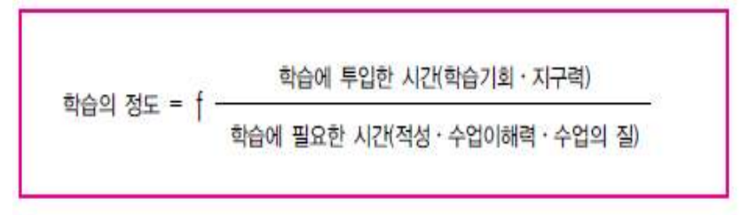
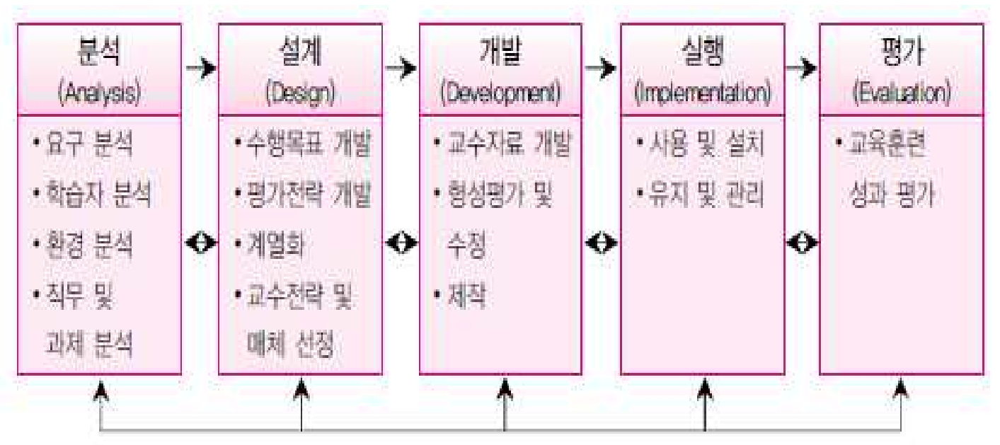
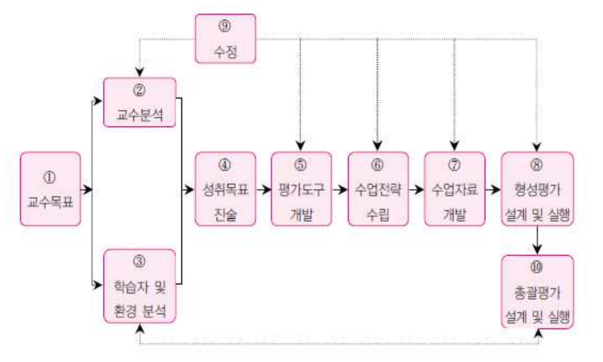

# 교육학개론 13주차

## 들어서며

* 

## 교육 방법, 교육공학

* 교육 방법:
* 교육 공학:

## (기말고사) 캐롤(Carroll)의 학교학습모형 방정식

## (기말고사) 켈러의 동기 이론(ARCS)

* 외적 동기: 용돈 등 외적 성취와 관련
* 내적 동기: 칭찬, 표용, 격려 등 내적 성취와 관련
* 학습 동기를 위해 필요한 4가지 요소
  * Attention: 주의/집중 => 학습과제에 대한 호기심과 관심을 유발시킴
  * Relevance: 관련성 => 학습의 필요와 목적에 대한 학습자의 지각 정도
  * Confidence: 성취 => 학습자의 성공에 대한 신념
  * Satisfaction: 만족감 => 학습자 성취에 대한 보상
* ARCS의 가지 요소는? 주의/집중, 관련성, 성취, 만족감

## (기말고사) 실즈(Seels)와 리치(Rich)의 ADDIE 모형

* 분석 -> 설계 -> 개발 -> 실행 -> 평가
* 빈 칸 채우기(내용)

## (기말고사) 딕(Dick)과 캐리(Carey)의 체제적 교수개발모형

## 교육 평가

### 개요

*  Evaluation: Out + Value + Nation / ~바깥으로, 가치(잠재력), ~일 / 인간 내면의 잠재력을 바깥으로 이끌어 내는 일
* 학습자의 가치를 확인해주고 바깥으로 끄집어내는 일

## 내용

* 교육현장에서 평가활동을 수행할 때, 어떠한 평가 도구를 사용할 것인가의 문제는 매우 중요하다
* 평가도구가 좋은 것이 아니라면 그것으로 측정하고 평가한 결과는 의미가 없기 때문이다.

### 현대 교육평가의 방향

* 목표지향적: 절대평가
* 교육방법의 개선에 이바지: 수행평가 등
* 교육적: 잠재적 교육과정에 긍정적으로 이바지

## (기말고사) (중요) 교육평가 패러다임의 변화

* 과거: 결과중심의 평가
  * 상대적 비교, 성취 기준
  * 교사가 주체
* 최근: 학습의 배움을 위한 평가
  * 성취기준
  * 교사가 주체
* 최근: 학습 과정으로서의 평가
  * 학생 개별 목표와 성취기준
  * 학생이 주체

## 인지적 특성의 개념

### 인지적 영역

* 기억, 이해, 적용, 분석, 종합, 평가, 비교, 판단 등
* 사고작용을 통해 획득하고 활용하는 학습내용과 행동
* 사고과정을 평가

### 인지적 영역의 평가

* 지식, 이해력, 적응력, 분석력, 종합력, 평가력과 같은 학생의 인지적 사고과정을 평가

### Bloom의 인지적 특성에 대한 교육목표 분류 위계

* 평가(복잡)
* 종합
* 분석
* 적용
* 이해
* 지식(단순)

* 누가적, 복합적, 위계적 성질을 지니고 있음

## 정의적 특성

### 개요

* 인간행동의 에너지와 활력을 주며, 행동의 방향을 정해주는 심리적 요인

### 내적동기와 외적동기

* 내적동기: 행동 자체에 즐거움을 느껴 발생하는 능동적인 동기
  욕구, 흥미, 호기심, 즐거움, 만족, 성취
* 외적동기: 행동에 따른 보상을 목표로 발생하는 약하고 수동적인 동기
  보상, 사회적압력, 벌, 돈, 맛있는 음식, 특구너 학점, 승진, 인정

### 정리

* 태도, 가치관, 도덕성 등과 같은 감정이나 정서를 나타내는 인간의 전형적인 속성

### 정의적 특성의 평가

* 표적: 감정이 지향하는 현상, 알 수 있는 경우도 있고 알 수 없는 경우도 있음
* 방향: 감정의 적극적 또는 소극적 방위와 관련
* 밀도: 감정의 감도. 어떤 것은 다른 감정보다 전형적으로 강도가 높음

### 정의적 영역에 대한 평가가 중요한 이유

* 성숙한 인격체를 구성하는 가장 핵심적 요소의 하나가 정의적 특성
* 학교 학습에서 중요한 추진적 역할
* ? ? ? 