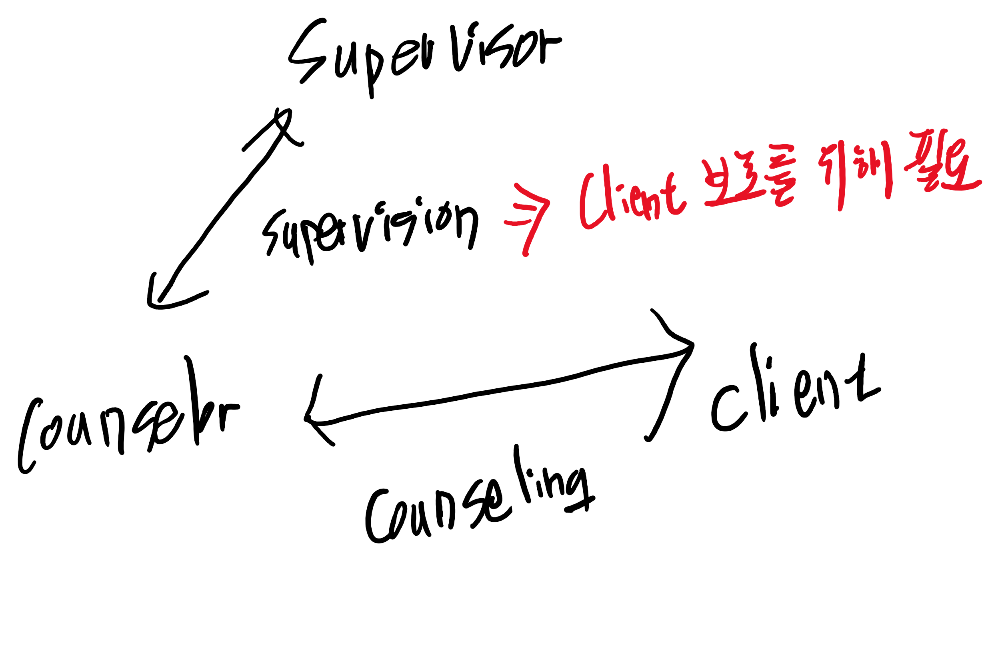

# 교육학개론 14주차

## 들어서며

* 학교의 활동 2가지: 학습지도, 생활지도

## 생활지도와 상담의 기초

### 상담(counseling)

* 전문적인 상담자(counselor)가 도움이 필요한 내담자(client)에게 상담을 제공
  => 전문 기술이 요구됨
* counselor <=> client ::: 상담(counseling)
* counselor가 대응하기 어려운 client의 경우, supervisor(수련감독자)에게 조언을 구해야 한다.
  => supervision(수련감독) - client 보호를 위해 필요
* 