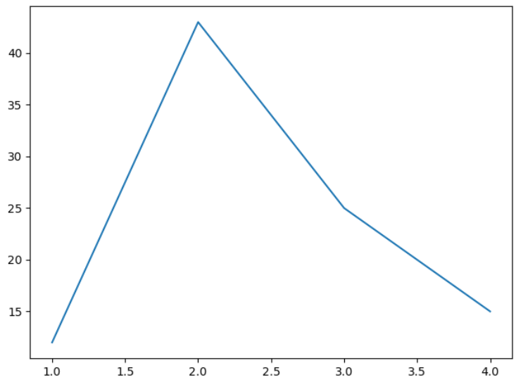
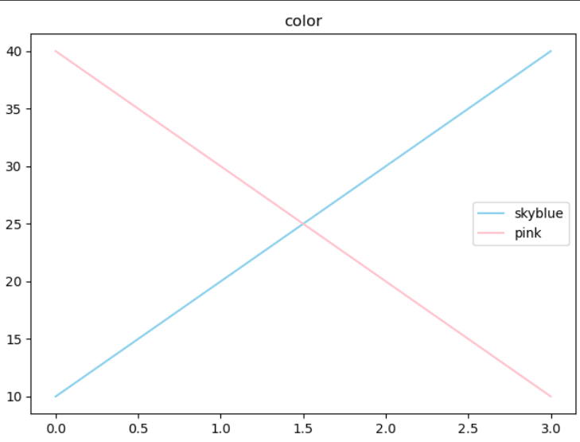
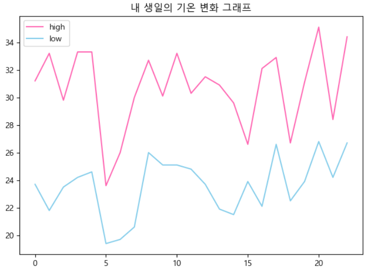
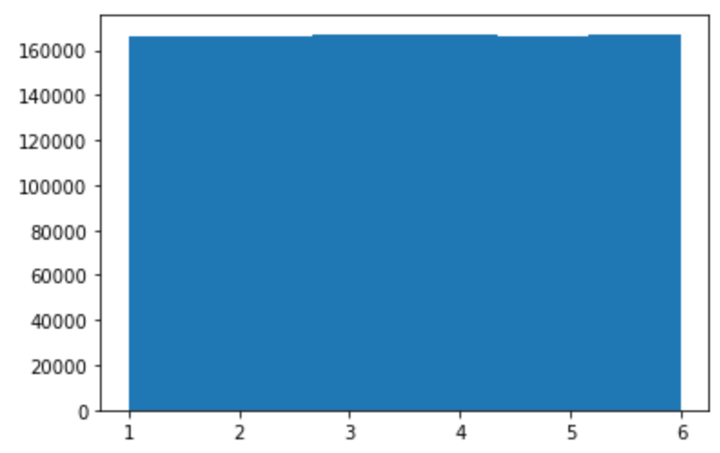
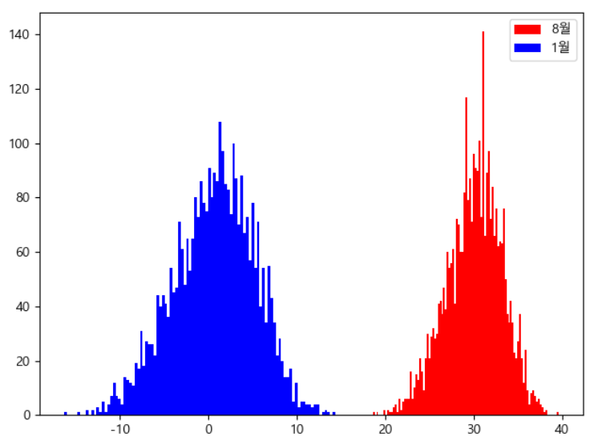
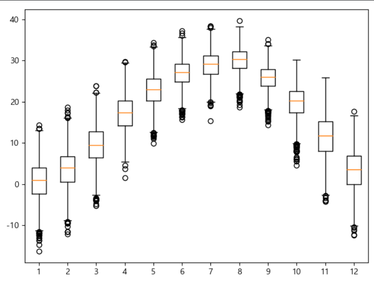
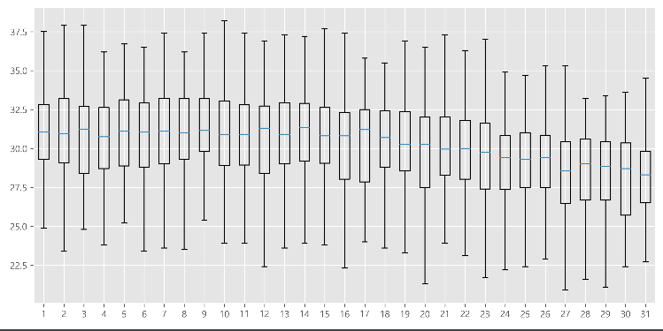

# 파이썬(2) - 13주차 / 1905096(진태양)

## 데이터 분석

* 파이썬을 이용해 빠르고, 쉽고, 강력하게 처리할 수 있음
  => using Library that `Matplotlib`, `Numpy`,`Pandas`
* 내가 가지고 있는 데이터 혹은 외부로부터 획득한 데이터를 분석하여 다른 서비스(의사결정)를 보조하기 위한 방법
* 기존 데이터의 분석은 새로운 것을 결정하는데 매우 중요하게 작용한다.

## CSV 파일

* Comma Separated values의 약자
* 데이터를 저장하는 파일 형태의 일종(XML, JSON, etc.)
  * XML, JSON은 HTTP(Web) 통신에 주로 사용
  * CSV는 독립적인 환경에서 주로 사용(배포, 공급 등)
* 각각의 데이터 값을 콤마(,)로 구분하는 파일 형식

## (추가학습  01) 서울의 최고/최저 기온은 언제였을까?

```python
import csv  # CSV 모듈 불러오기

f = open('seoul.csv', encoding='ISO-8859-1')  # seoul.csv 파일 읽기 모드로 불러오기

data = csv.reader(f)
header = next(data)  # 맨 윗줄을 header 변수에 저장하기

max_temp = -999  # 최고 기온을 저장할 변수 초기화
max_date = ''

min_temp = 999  # 최저 기온을 저장할 변수 초기화
min_date = ''

for row in data:
    if row[-1] == '':  # 만약 데이터가 누락되었다면 최고 기온을 -999로 저장
        row[-1] = -999

    if row[-2] == '':  # 만약 데이터가 누락되었다면 최저 기온을 999로 저장
        row[-2] = 999

    row[-1] = float(row[-1])  # 문자열로 저장된 최고 기온 값을 실수로
    row[-2] = float(row[-2])  # 문자열로 저장된 최저 기온 값을 실수로

    if max_temp < row[-1]:  # 만약 지금까지 최고 기온보다 더 높다면 업데이트
        max_date = row[0]
        max_temp = row[-1]

    if row[-2] < min_temp:  # 만약 지금까지 최저 기온보다 더 낮다면 업데이트
        min_date = row[0]
        min_temp = row[-2]

f.close()  # 파일 닫기
print('기상 관측 이래 서울의 최고 기온이 가장 높았던 날은', max_date + '로,', max_temp, '도 였습니다.')  # 출력
print('기상 관측 이래 서울의 최저 기온이 가장 낮았던 날은', min_date + '로,', min_temp, '도 였습니다.')  # 출력

```


## matplotlib

### 개요

* 파이썬으로 데이터를 시각화할 때 가장 많이 사용하는 라이브러리
* 2D 형태의 그래프, 이미지 등을 그릴 때 사용
* 실제 과학 컴퓨팅 연구 분야나 인공지능 연구 분야에서도 많이 활용

### (code 02)  기본 그래프(라인 그래프) 그리기



```python
import matplotlib.pyplot as plt

plt.plot([1, 2, 3, 4], [12, 43, 25, 15]) # plt.plot(x축 데이터셋, y축 데이터셋)
plt.show()
```

### (code 03)그래프 제목, 색상, 범례 넣기



```python
import matplotlib.pyplot as plt

plt.title('color')  # 제목 설정

plt.plot([10, 20, 30, 40], color='skyblue', label='skyblue')
plt.plot([40, 30, 20, 10], 'pink', label='pink')

plt.legend()  # 범례 표시

plt.show()
```

### color, 마커 관련

* r: red, b: blue, g: green, k: black
* r. : 빨간색 원 마커
* g^ : 녹색 삼각형 마커

### (code 06) 내 생일의 최고 기온 및 최저 기온 변화를 데이터 시각화



```python
# 내 생일(8월 13일)의 기온 변화를 1996년 이후로 꺽은선(라인) 그래프로 그리기
import csv
import matplotlib.pyplot as plt

f = open('seoul.csv', encoding='ISO-8859-1')
data = csv.reader(f)
next(data)  # 첫줄 해드 스킵
high = []
low = []

# 생일 설정
birth_year = 1996
birth_month = str(8).rjust(2, '0')
birth_day = str(13)

for row in data:
    if row[4] != '' and row[3] != '':  # 최고기온과 최저기온이 존재하면
        date = row[0].split('-')
        if birth_year <= int(date[0]):  # 태어난 해 이후의 데이터만 다룬다.
            if date[1] == birth_month and date[2] == birth_day:  # 생일이라면
                high.append(float(row[4]))
                low.append(float(row[3]))

plt.rc('font', family='Malgun Gothic')  # 한글폰트 설정
# plt.rcParams['axes.unicode_minus'] = False   #마이너스 기호 깨짐
plt.title('내 생일의 기온 변화 그래프')
plt.plot(high, 'hotpink', label='high')  # high 리스트에 최고기온들을 표시
plt.plot(low, 'skyblue', label='low')  # low 리스트에 저장된 최저기온들을 표시

plt.legend()  # 범례표시 지시
plt.show()  # 그래프 출력
```

### (code 07)  히스토그램 주사위 시뮬레이션



```python
#히스토그램(데이터 누적 그래프) - 주사위 시뮬레이션
import random
dice = []
for i in range(1000000) :
    dice.append(random.randint(1,6))   #1과 6사이의 난수를 dice 리스트에 추가

import matplotlib.pyplot as plt
plt.hist(dice, bins=6)   #가로축 구간(bins)을 6개로 히스토그램 표시
plt.show()
```

* 많은 횟수를 수행할수록 균등분포

### (code 08)  기온 데이터를 히스토그램으로 표현하기



```python
# 1월과 8월의 최고기온을 히스토그램으로 표시하기
import csv
import matplotlib.pyplot as plt

f = open('seoul.csv', encoding='ISO-8859-1')
data = csv.reader(f)
next(data)

aug = []
jan = []

for row in data:
    month = row[0].split('-')[1]  # 날짜에서 월만 뽑아서
    if row[4] != '':
        if month == '08':
            aug.append(float(row[4]))
        if month == '01':
            jan.append(float(row[4]))
plt.hist(aug, bins=100, color='r', label='8월')
plt.hist(jan, bins=100, color='b', label='1월')
plt.legend()
plt.show()
```

### (code 11)  월별로 최고기온을 boxplot 으로 표시하기

* 최대값, 3/4값, 2/4값, 1/4값, 최소값을 표시할 수 있음



```python
# 월별로 최고기온을 boxplot 으로 표시하기
import csv
import matplotlib.pyplot as plt

f = open('seoul.csv', encoding='ISO-8859-1')
data = csv.reader(f)
next(data)

# 월별 최고기온을 저장할 리스트 month를 12개 생성
month = [[], [], [], [], [], [], [], [], [], [], [], []]

# 더 좋은 방법
# month = []
# for i in range(12) :   #month 리스트 내에 12개의 리스트 생성
#     month.append([])


for row in data:
    if row[4] != '':
        # 월과 같은 숫자 - 1 위치의 리스트(1월이면 month[0])에 최고기온 저장
        month[int(row[0].split('-')[1]) - 1].append(float(row[4]))

plt.boxplot(month)
plt.show()
```

### (code 12) 8월 일별 최고기온을 boxplot으로 표시하기



```python
# 8월 일별 최고기온을 boxplot 으로 표시하기
import csv
import matplotlib.pyplot as plt

f = open('seoul.csv', encoding='ISO-8859-1')
data = csv.reader(f)
next(data)

day = []
for i in range(31):  # day 리스트 내에 31개의 리스트 생성
    day.append([])

for row in data:
    if row[4] != '':
        if row[0].split('-')[1] == '08':  # 8월 이면
            day[int(row[0].split('-')[2]) - 1].append(float(row[4]))

plt.style.use('ggplot')  # 그래프 스타일을 ggplot이라는 스타일로 수정(배경-회색격자무늬, 2/4값을 의미하는 색을 변경)
plt.figure(figsize=(10, 5), dpi=300)  # 그래프 크기((가로,세로) 인치 단위) 수정
plt.boxplot(day, showfliers=False)  # 이상치 값이 보이지 않게 설정
plt.show()
```

## 공공데이터

### 우리 동네 인구 구조 시각화하기

1. 인구 데이터 파일을 읽어온다.
2. 전체 데이터에서 한 줄씩 반복해서 읽어온다.
3. 우리 동네에 대한 데이터인지 확인한다.
4. 우리 동네일 경우 0세부터 100세 이상까지의 인구수를 순서대로 저장한다.
5. 저장된 연령별 인구수 데이터를 시각화한다.