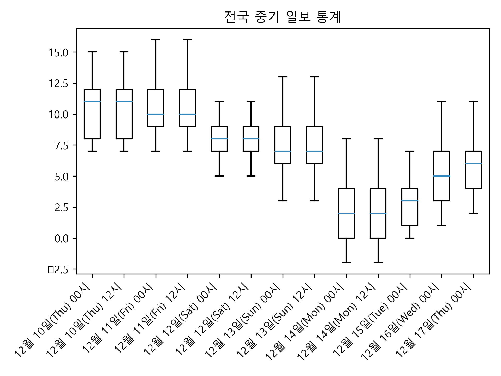

# 파이썬(2) - 13주차 / 1905096(진태양)

## 개요

* 기상청 공공데이터 RSS 활용
* 전국 및 지역 별 일주일 날씨(최고 기온, 최저 기온) 추출
* 예측 시점에 대한 전국 통계, 지역 별 통계 제공
* 이미지 파일 저장 후 html 문서로 일괄 확인

### 소스코드

```python
import urllib.request
import xml.etree.ElementTree as ET
import matplotlib.pyplot as plt
import datetime
import os

url = 'http://www.weather.go.kr/weather/forecast/mid-term-rss3.jsp?stnId=108'

data = urllib.request.urlopen(url).read()

channel = ET.fromstring(data).find('channel')

print('어느 지역의 중기예보를 조회하시겠습니까?')
print('----------------------------------------------')
print('전국', '서울', '인천', '수원', '파주', '이천', '평택', '춘천', '원주', '강릉', '대전')
print('세종', '홍성', '청주', '충주', '영동', '광주', '목포', '여수', '순천', '광양', '나주')
print('전주', '군산', '정읍', '남원', '고창', '무주', '부산', '울산', '창원', '진주', '거창')
print('통영', '대구', '안동', '포항', '경주', '울진', '울릉도', '제주', '서귀포')
print('----------------------------------------------')

target_location = input('입력: ')

body = channel.find('item').find('description').find('body')

# RSS 파싱 준비
locations = body.findall('location')
html_data = ''
list_total = {}
for location in locations:
    city = location.find('city').text

    # 전국이 아니며, 입력한 지역이 아니라면 Pass
    if target_location != '전국' and city != target_location:
        continue

    # Python Console에 Table 형태로 1차 출력 준비
    print('<%s>' % city)
    datas = location.findall('data')
    print('----------------------------------------------')
    print('{:^16}{:>6}\t{:>6}{:>6}'.format('예보일', '날씨', '최저기온', '최고기온'))
    print('----------------------------------------------')

    list_tmEf = []
    list_tmn = []
    list_tmx = []

    for data in datas:
        # 예보일, 날씨, 최저기온, 최고 기온 파싱
        tmEf = data.find('tmEf').text
        wf = data.find('wf').text
        tmn = data.find('tmn').text
        tmx = data.find('tmx').text

        # 시각화를 위한 사전준비 - 지역별/날짜별 최저기온, 최고기온
        d = datetime.datetime.strptime(tmEf, '%Y-%m-%d %H:%M')
        list_tmEf.append(d.strftime('%m월 %d일(%a) %H시'))
        list_tmn.append(tmn)
        list_tmx.append(tmx)

        # 전국 통계 집계를 위한 데이터 저장
        if tmEf not in list_total:
            list_total[tmEf] = {'tmn': [], 'tmx': []}

        list_total[tmEf]['tmn'].append(tmn)
        list_total[tmEf]['tmx'].append(tmx)

        # Python Console에 Table 형태로 1차 출력
        print('[{:^16}]{:>6}\t{:>7}{:>7}'.format(tmEf, wf, tmn, tmx))

    # 지역별 시각화
    plt.rc('font', family='Malgun Gothic')  # 한글폰트 설정
    # plt.rcParams['axes.unicode_minus'] = False   #마이너스 기호 깨짐
    plt.title('{} 중기 일보'.format(city))
    plt.plot(list_tmEf, list_tmn, 'skyblue', label='최저기온')  # low 리스트에 저장된 최저기온들을 표시
    plt.plot(list_tmEf, list_tmx, 'hotpink', label='최고기온')  # high 리스트에 최고기온들을 표시
    plt.xticks(rotation=45, ha='right')

    plt.legend()  # 범례표시 지시
    plt.tight_layout(h_pad=0.1)
    plt.savefig('_{}.png'.format(city), dpi=300)
    plt.close()

    # html 문서 data 설정
    html_data = html_data + \
                ' <br/>'.format('{}.png'.format(city), city)

    print('----------------------------------------------')
    print()
    print()

# 전국 통계 시각화
if target_location == '전국':
    avg_tmn = []
    avg_tmx = []
    list_tmEf = []
    for key, value in list_total.items():
        avg_tmn.append(list(map(lambda x: int(x), value['tmn'])))
        avg_tmx.append(list(map(lambda x: int(x), value['tmx'])))

        d = datetime.datetime.strptime(key, '%Y-%m-%d %H:%M')
        list_tmEf.append(d.strftime('%m월 %d일(%a) %H시'))

    plt.rc('font', family='Malgun Gothic')  # 한글폰트 설정
    # plt.rcParams['axes.unicode_minus'] = False   #마이너스 기호 깨짐
    plt.title('전국 중기 일보 통계')
    plt.style.use('ggplot')
    plt.boxplot(avg_tmx, showfliers=False)  # 이상치 값이 보이지 않게 설정
    plt.xticks(range(1, 14), list_tmEf, rotation=45, ha='right')

    plt.tight_layout(h_pad=0.1)
    plt.savefig('_전국.png', dpi=300)

    html_data = ' <br/>' + html_data

# html 파일
f = open('result.html', 'w')
f.write(html_data)
f.close()

# html 파일 실행
os.system("start result.html")
```

<div style="height:180px;"></div>

## 실행 결과 - 전국

### 1. 조회 지역 입력


### 2. Python Console 1차 출력(Table)


### 3. html 문서를 이용한 2차 출력(차트)


## 실행 결과 - 지역별

### 1. 조회 지역 입력


### 2. Python Console 1차 출력(Table)


### 3. html 문서를 이용한 2차 출력(차트)


