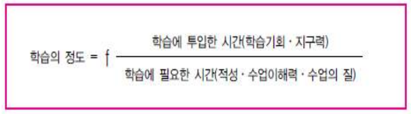
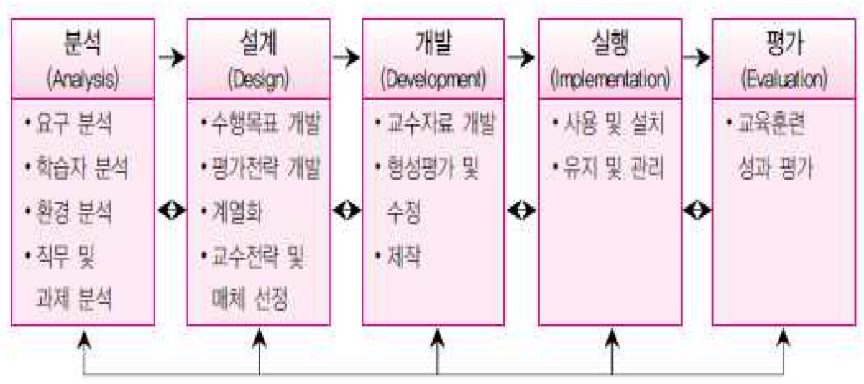
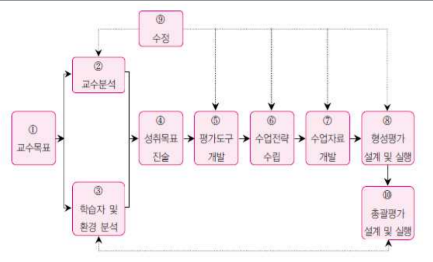

## 인공지능 시대 교사의 역할

* 인간과 인고지능의 관계는 경쟁이 아닌 공생이다
* 선생님들은 더욱 인간적인 관계를 중심으로 학생들의 멘토나 코치 역할을 할 수 있어야 한다.

## 한국 교육과정의 변천 - 학교에서는 무엇을 가르쳐야 하는가

### 2009, 2015 교육과정 개정 방향

2015 개정 교육과정에서는 바른 인성을 가지고 인문학적 상상력과 과학기술 창조력으로 새로운 지식을 창조하고 다양한 지식을 융합하여 새로운 가치를 창출할 수 있는 사람으로 정의

| 2009 개정 교육과정                                           | 2015 개정 교육과정                                           |
| ------------------------------------------------------------ | ------------------------------------------------------------ |
| 창의적인 인재 양성                                           | 창의융합형 인재 양성                                         |
| 전인적 성장을 위한 창의적체험활동 강화                       | 모든 학생이 인문사회과학에 대한 기초 소양 함양               |
| 국민공통교육과정 조정 및 학교교육과정 편성 운영의 자율성 강화 | 학습량 적정화, 교수학습 및 평가 방법 개선을 통한 핵심역량 함양 교육 |
| 교육과정 개편을 통한 대학수학시험 제도 개혁 유도             | 교육과정과 수능·대입제도 연계, 교원 연수 등 교육 전반 개선   |

## 교육과정

* 현재, 입시 중심의 커리큘럼이 주를 이루고 있다.
* 그러나 특정 자격증이 있다고 해당 분야에 능력이 있다고 볼 수 없다. 실질적인 경험이 중요하다.
* 교육의 목적과 방향을 제시해주는 것이라 볼 수 있다.

### Curriculum

* 라틴어, currere에서 유래, 경마장의 말이 뛰는 길을 의미
* 학교 교육과정의 영역
  * 왜: 내용 선정의 근거
  * 무엇: 내용
  * 어떻게: 내용 조작과 교육방법
  * 얼마만큼 가르쳤는가
* 교육과정 = 학생이 일정한 목표를 향해서 학습하는 진로 또는 내용

### 개념

#### 계획된 교육과정: 표면적 교육과정, 문서로서의 교육과정

* 국가교육과정(교육인적자원부): 초중등학교 교육과정(총론과 각론)
* 지역교육과정(시도 교육청): 교육과정 편성/운영지침
* 학교교육과정(각 학교): 학교 운영계획

#### 전개된 교육과정: 실천으로서의 교육과정

  * 학교에서 실제로 실천되고 있는 교육활동

#### 실현된 교육과정: 성과/산출로서의 교육과정

  * 학생들이 실제로 갖게 되는 경험이나 성취

#### 잠재적(latent) 교육과정: 의도되지 않은 산출로서의 교육과정

  * 교육과정에 명시적으로 계획되거나 의도되지 않았지만 학생들이 학교생활 중 은연 중에 얻게 되는 경험이나 산출

#### 영 교육과정

* 꼭 필요한 내용인데도 불구하고 배제된 교육과정

### 표면적 교육과정 / 잠재적 교육과정

표면적 교육과정과 잠재적 교육과정이 서로 조화되고 상보적인 관계가 있을 때 학생 행동에 강력한 영향을 줄 수 있다.

| 표면적 교육과정 | 잠재적 교육과정 |
| ---- | ---- |
| 학교에서 계획하여 의도적으로 실시한다. | 학교에 의해 의도되지는 않았지만 학교생활을 하는 동안 은연중에 배운다. |
| 지적인 것과 관련이 있다.                          | 비지적/정의적인 영역과 관련이 있다.                          |
| 교과와 관련이 있다.                               | 학교의 문화풍토와 관련이 있다.                               |
| 단기적으로 배우며 어느 정도 일시적인 영향이 있다. | 장기적/반복적으로 배우며 보다 항구성을 지닌다.               |
| 교사의 지적/기능적인 면의 영향을 받는다.          | 교사의 인격적인 강화를 받는다.                               |
| 바람직한 내용이 포함된다.                         | 바람직한 것뿐만 아니라 바람직하지 못한 것도 포함된다.        |

## 교육과정의 유형

### 교과중심 교육과정

* 기본적 견해
  * 교육의 주요 기능은 인류의 위대한 문화유산을 다음 세대에 전달하는 것
  * 인류의 고유한 논리적 체계성이 교과에 녹아있으며, 이를 학습함으로써 유용하게 활용할 수 있음
* 특징
  * 교육의 내용이 인류의 문화유산이 됨
  * 교육의 주체는 교사
* 장점
  * 인류의 문화유산을 효과적 전달에 용이
  * 교과별로 정리, 체계적으로 가르칠 수 있음
  * 조직이 단순, 쉽게 이해
  * 결과 평가 용이, 객관적인 측정이 쉬움
  * 교사, 학생, 학부모들에게 심리적 안정감을 줌
  * 교육과정에 대한 중앙집권적 통제와 계획 용이
* 단점
  * 단편적인 지식 주입
  * 학생들의 흥미, 능력, 필요가 무시당할 염려가 있음
  * 고등정신 능력을 기르기 어려움
  * 과거의 지식교육만 강조
  * 학습내용이나 학습경험의 조직, 배열이 비능률적
  * 전체로서의 통일성, 연관성 부족

## 교육현장

* 학생들의 개인차(지능, 창의성)를 이해할 필요성이 있음
* 교육심리학의 적용 - 정의적 발달, 인지적 발달

## 효과적인 교육 - 교육학개론의 필요성

* 효과적으로 목표에 도달하기 위해서는 자기 자신(대상)의 이해가 요구됨
* 교육방법의 혁신(개선)
  * 왜 가르쳐야 하는가
  * 무엇을 가르칠 것인가
  * 어떻게 가르칠 것인가

## 학교에서의 지도

* 교과 지도 + 생활 지도
* 그러나 교과 지도에 편향되는 경향이 있다.

---

* 창의성: 새롭고 독특하고 유용하고 적합한 것을 만들어내는 능력
* 문제해결의 과정: 확산적 사고 + 수렴적 사고를 통해 문제 해결

---

## 창의적 인재의 4가지 요소

* 차별성
* 실행력
* 과제설정
* 문제해결

## 교육과정의 구성과 절차

* 1단계: 교육 목표 수립
* 2단계: 교육 내용 선정
* 3단계: 교육 내용 조직
  초등학교 5학년에게 수학을 가르칠 때, 어느정도 범위와 계열로 가르칠 것인가.
  * 범위(폭)
  * 계열(깊이)
* 4단계: 교육 평가(Evaluation: E + Value)
  사람이 가지고 있는 가치를 이끌어내는 것

## 학습

### 개요

* 유기체의 의도적인 활동을 통한 결과와 경험을 바탕으로 생성되는 비교적 영속적인 인지적/행동적 변화
* 타고난 반응 경향에 의한 행동, 성숙으로 인한 자연적 변화, 질병이나 사고로 인한 일시적 변화는 학습이 아니다.

### 학습에 의한 행동 변화 공식

```
학습(L) = A - (B + C + D)
A: 개인에게 일어나는 모든 변화
B: 자율적 반응 경향에 의한 변화
C: 성숙에 의한 변화
D: 일시적 변화
```

### 각 이론별 정의들의 공통적 특징

* 학습은 행동이나 사고의 변화를 수반
* 학습은 경험의 결과를 통해 발생
* 학습의 결과는 지속적

### 교육에 따른 보상

* 보상은 대상자의 수준에 따라 책정해야 한다.
* 이러한 보상을 통해 학습자를 격려할 수 있으며 최종 학습에 긍정적 영향을 미친다.

### 학교 학습의 성격

```
1. 경험
2. 태도
3. 만남

시사점: 실험실 학습에서 발견되는 학습의 원리나 법칙들을 실제 학교 학습에 바로 적용하기는 어려우며, 학교 학습의 상황을 고려한 나름의 학교학습이론이 개발되어야 한다.
```

* 학습자가 다양하다
* 과거 경험과의 연결성의 문제이다
* 학습의 기준이 다르다
* 학습 과제의 질이 다르다
* 학습을 통제하는 기술이 다르다
* 학습자의 '개인차'를 보는 관점이 다르다
* '학습자의 수'에 대한 제한이 다르다
* 학습의 목적성과 효용성의 차이가 다르다

## 교수

### 개요

* 학습의 촉진을 위해 정보, 상황, 조건 등 제반 환경을 조성하고 제공하는 특성을 가지고 있음
* 교사가 수업시간에 가르치는 활동(수업)을 포함
* 수업을 준비하고 실행하며 평가하는 모든 활동을 포함하는 포괄적인 것

## 교수와 학습의 관계 및 차이점

|    교수     |                학습                |
| :---------: | :--------------------------------: |
| 의도적 활동 | 의도하지 않은 결과에 의해서도 가능 |
|  교실 상황  |      교실상황 이외에서도 가능      |
|   처방적    |               기술적               |

## 학습이론의 흐름

### 개요

* 법칙(law): 어떤 현상에서 관찰 또는 실험을 통해 경험적으로 입증된 변인들 간의 관계의 진술
* 원리(principle): 법칙에 비하여 규칙성이 낮고, 원리가 성립되기 위한 전제나 가정의 자명성 부족
* 이론(theory): 구조적 또는 기능적으로 서로 유사성과 관련성이 높은 두 개 이상의 법칙 또는 원리가 체제적으로 통합되어 있는 것
  * 이론의 기능
    * 새로운 사실의 발견(이론을 근거로 가설을 세우고 검증하여 사실 발견)
    * 단편적인 사실을 요약하고 상호 관련짓는 것
    * 기존에 관찰된 사실들을 설명한다는 것

### 관점

* 행동주의적 관점: 자극과 반응을 통한, 강화의 결과
* 인지주의적 관점: 학습을 인지 구조를 습득하는 것으로 파악
* 구성주의적 관점: 학습자가 지식을 구성해 나감으로써 학습을 성취 / 학습자에게 적합한 학습맥락의 구성이 중요한 요건

## 교수이론의 흐름

### 개요

* 교수이론은 학습목표의 효과적인 달성을 위한 방법을 연구하는 방법
* 바람직한 결과를 얻기 위한 최적의 학습환경을 구현하는 것

### 관점

* 행동주의적 관점: 행동주의 강화이론이나 행동수정 체제 이론 적용
* 체제이론적 관점: 통합적인 관점에서 교수활동을 계획하고 실행하는 관점
* 인지주의적 관점: 정보처리이론이나 인지주의적 관점이 적용
* 구성주의적 관점: 지식의 형성과정을 중요하게 다룸

## 수업

* 교사가 학생에게 지식이나 기능을 가르쳐 주는 행위(학습을 촉진시키기 위한 제반 활동): 교수와 학습이 결합
* 수업의 구성 요인: 학습환경(교수자 + 학습내용 + 학습자)

## 교수이론과 학습이론의 시사점

* 관심의 초점이 다르다
  * 학습심리학자들의 주된 관심은 유기체의 학습에 대한 포괄적인 기초이론을 수립
  * 수업 이론가들의 주된 관심은 교육 실제의 개선
* 이론이 성립되는 상황이 다르다
  * 학습이론이 연구되는 실험실 상황과 수업이 이루어지는 교실상황의 차이를 여러가지로 설명하여 접근
* 이론의 성격이 다르다
  * 학습 이론 - 기술적
  * 수업 이론 - 처방적

## 교육방법의 이해

### 개요

* 교육방법: 학습자가 교육 목표에 도달하게끔 효과적으로 안내하는 교수전략 혹은 수행 방법
* 교육공학과는 다르다.
* 교육방법 이해의 관점
  * 수업 기술: 교수 기법, 기술, 태도에 관심
  * 수업 과정에 관한 설계: 수업과정에 관한 모형을 기초로 수업과정 계획/활동
  * 수업내용의 조직 방식: 교과내용의 조직 방법

### 교육 내용과 수업, 학습의 관계


1. 교육과정에서 명시된 것을 적절하게 수업함으로써 학습자가 충분히 학습한 것을 나타냄
2. 교육과정에서 명시하고 있지만, 교사가 행한 수업에 의하지 않고 학습한 것
3. 교육과정에 명시 되지 않았지만, 수업을 통해 학습된 것
4. 교육과정에 명시된 것을 수업했으나, 학생이 학습하지 못한 것
5. 교육과정에 명시되어 있지만, 학습되지고 수업되지도 않은 것
6. 교육과정에 명시되지 않았고, 가르치지도 않았으나 학생이 학습하고 있는 것(잠재적 교육과정)
7. 교육과정에 없는 것을 교사가 수업을 통해 제시했으나 학습되지 않음

### 효과적인 교육방법

* 타인의 기대나 관심에 따라 일의 능률이나 학습의 효율이 향상되는 피그말리온 효과에 따라 각 학생에게 관심을 가져보자.
* Rosenthal Effect
  * 임의의 학생을 우수한 학생이라고 교사에게 알려줌
  * 교사는 긍정적인 기대에 따라 학생들을 친절하게 교육하고 다독여줌
  * 학기 말, 해당 학생의 성적은 실제로 향상
* 교사의 기대와 격려(긍정적인 관심과 사랑)가 중요한 영향을 미쳤다.
  * (기말고사) 다음 중 교사의 긍정적 기대와 격려가 학습의 성과에 미치는 영향을 올바르게 연결한 것은?

### (기말고사) 좋은 수업의 특징

* Plan: 수업 설계가 탄탄해야 한다. (구체적인 계획과 설계)
* Process: 수업의 과정(절차)가 중요하다 (쉬운 것->어려운 것, 구체적인 것->추상적인 것)
* Practices:  연습, 시뮬레이션, 데모가 존재한다. (단순히 듣는 것이 아닌 오감을 이용한 학습 수행)
* Products: 학습 결과물에 대한 피드백 수행

---

## 기업은 어떤 인재를 원하는가

* 회사에 금전적 이득을 줄 수 있는가 - 전문지식
* 공동 목표 수립에 긍정적인가 - 인성 및 태도
* 비윤리적 / 비도덕적 사람은 비선호한다.

## 지원 동기 꿀팁

인간의 권리를 이야기하자. 인간은 누구나 xx 기술의 혜택을 누릴 권리가 있다고 생각합니다. 저는 모든 사람들이 이러한 혜택을 받을 수 있도록 귀사와 함께 일하고 싶습니다.

---

## (기말고사) 교육과 교육학의 차이

* 교육: 의도적인 과정을 통해 인간 행동을 변화하게 하는 활동
  E + ducare => 인간 내면을 바깥으로 꺼내어 극대화 시켜주는 것이 교육(education)이다.
* 교육학: 교육을 실천하는데 있어서 발생하게 되는 Why, What, How에 대한 물음을 과학적으로 연구하는 학문

## 교수와 학습의 관계

* 교수(teaching): 처방적 => 이렇게 하면 좋고, 이렇게 하면 좋다.
  * 독립변수: 가르치려고 함
  * 좋은 교사의 역할: Protect(외부 환경으로 부터 학습자를 보호)
* 학습(learning): 기술적 => 처방을 받아 전략적으로 적용(Skill)
  * 종속변수: 교수에 의해 학습됨

## 수업과 학습의 차이점

* 의도적 작용 vs 무의도적 작용
* 독립변수 vs 종속변수
* 일의적 vs 다의적
* 처방적 vs 기술적

## 좋은 수업의 특징

* 수업목표를 명확히 하고 학습자에게 확인
* 지적, 정서적, 사회적, 신체적 발달의 조화
* 학습자의 탐구심 충족, 창의성 신장
* 학습자 중심, 학습자의 필요, 흥미, 노력에 기초
* 학습자의 개인차 인정, 개인차에 알맞은 수업방안 모색
* 협동적 경험의 중시

## 학습지도

### 원리

* 개별화의 원리, 자발성의 원리, 직관의 원리, 사회화의 원리, 통합의 원리, 목적의 원리, 과학성의 원리, 생활화의 원리

### 조건

* 효과의 법칙, 준비성의 법칙, 접근의 법칙, 반도의 법칙, 개별화의 법칙

---

## (사설) 논리적 의사소통

* 자기 의견과 관련해서 공감
* 자기 주장
* 주장 근거
* 공감
* 자기 주장

---

## 수업의 이해

### (기말고사)수업에서의 고려 요인

수업은 (전, 중, 후)로 나뉜다

* 수업 전: 내용의 선택, 수업시간 배당, 학습진도의 조절, 학습진단의 결정
* 수업 과정: 학습효과를 최고로 올리기 위한 내용, 활동 구조화
* 수업 후: 수업목표 달성도 평가, 평가 결과 활용, 적절한 피드백의 활용

### 초두-최신 효과(Primary-Rcency Effect)

* 순차적 위치효과
  * 처음:  95% / 제 1황금시간(Prime-time-1) / 새로운 자료, 중요한 자료
  * 중간: 20% 미만
  * 마지막: 65% ~ 90%
* 강의 효과: 첫 15분(75%) / 마지막 15분(20%)

### 학습자 중심의 교수학습: 가르치지 말고 참여시켜라

* 단순히 읽고 들은 것은 기억에 많이 남지 않는다.
* 타인을 가르치거나 말하고 행동하는 경우, 많은 내용이 기억에 남게 된다.

### 강의 기본기술

* 언어적 기술: 발음, 목소리, 말의 강약, 말의 속도, 유머, 공감, 존중, 지지, 경청
* 비언어적 기술: 옷차림, 표정, 태도/자세, 시선, 위치 및 움직임, 손의 위치

### 질문과 발문

* 질문: yes / no로 대답
* 발문: 학습자의 생각을 이끌어 내는 질문

### 교수설계

* 수업을 체계적으로 구성하는 과정
* 잘 배우는 방법을 개발하는 방법에 대한 이론

### (기말고사) 수업 설계의 중요성

* 무엇을 배우고 무엇을 할 수 있게 되는지 확인
* 수업의 효과를 극대화
* 수업에 대한 전체적인 구조 확인

## 수업의 단계

### (기말고사) 도입 단계

* 동기 유발: 학습할 내용과 관련이 있는 예화나 경험담을 들려주어 학습자의 관심을 유도
* 수업 목표 제시
* 이전 학습과 관련짓기

### 전개 단계

* 수업의 중심 활동
* 학습내용의 제시
* 학습자료의 제시
* 학습자의 참여 유도

### (기말고사)정리 단계

* 요약 및 종합
* 연습과 피드백을 통한 강화 - 정적강화, 부적강화
* 보충자료 제시 및 차시 예고

## 교육 방법과 교육 공학

* 교육 방법:
* 교육 공학:

## (기말고사) 캐롤(Carroll)의 학교학습모형 방정식



## (기말고사) 켈러의 동기 이론(ARCS)

* 외적 동기: 용돈 등 외적 성취와 관련
* 내적 동기: 칭찬, 표용, 격려 등 내적 성취와 관련
* 학습 동기를 위해 필요한 4가지 요소
  * Attention: 주의/집중 => 학습과제에 대한 호기심과 관심을 유발시킴
  * Relevance: 관련성 => 학습의 필요와 목적에 대한 학습자의 지각 정도
  * Confidence: 성취 => 학습자의 성공에 대한 신념
  * Satisfaction: 만족감 => 학습자 성취에 대한 보상
* ARCS의 4가지 요소는? 주의/집중, 관련성, 성취, 만족감

## (기말고사) 실즈(Seels)와 리치(Rich)의 ADDIE 모형



* 분석 -> 설계 -> 개발 -> 실행 -> 평가
* 빈 칸 채우기(내용)

## (기말고사) 딕(Dick)과 캐리(Carey)의 체제적 교수개발모형



## 교육평가

### 개요

* Evaluation
  * Out(~바깥으로) + Value(가치, 잠재력) + Nation(~일)
  * 인간 내면의 잠재력을 바깥으로 이끌어 내는 일
  * 학습자의 가치를 확인해주고 바깥으로 끄집어내는 일

### 내용

* 교육현장에서 평가활동을 수행할 때, 어떠한 평가 도구를 사용할 것인가의 문제는 매우 중요하다
* 평가도구가 좋은 것이 아니라면 그것으로 측정하고 평가한 결과는 의미가 없기 때문이다

### 현대 교육평가의 방향

* 목표지향적: 절대평강
* 교육방법의 개선에 이바지: 수행평가 등
* 교육적: 잠재적 교육과정에 긍정적으로 이바지

## (기말고사) (중요) 교육평가 패러다임의 변화

* 과거: 결과중심의 평가
  * 상대적 비교, 성취 기준
  * 교사가 주체
* 최근: 학습의 배움을 위한 평가
  * 성취기준
  * 교사가 주체
* 최근: 학습 과정으로서의 평가
  * 학생 개별 목표와 성취 기준
  * 학생이 주체

## 인지적 특성

### 인지적 영역

* 기억, 이해, 적용, 분석, 종합, 평가, 비교, 판단 등
* 사고작용을 통해 획득하고 활용하는 학습내용과 행동
* 사고과정을 평가

### 인지적 영역의 평가

* 지식, 이해력, 적응력, 분석력, 종합력, 평가력과 같은 학생의 인지적 사고과정을 평가

### Bloom의 인지적 특성에 대한 교육목표 분류 위계

* 평가(복잡)
* 종합
* 분석
* 적용
* 이해
* 지식(단순)
* 누가적, 복합적, 위계적 성질을 지니고 있음

## 정의적 특성

### 개요

* 인간행동의 에너지와 활력을 주며, 행동의 방향을 정해주는 심리적 요인

### 내적동기와 외적동기

* 내적동기: 행동 자체에 즐거움을 느껴 발생하는 능동적인 동기
  * 욕구, 흥미, 호기심, 즐거움, 만족, 성취
* 외적동기: 행동에 따른 보상을 목표로 발생하는 약하고 수동적인 동기
  * 보상, 사회적압력, 벌, 돈, 맛있는 음식, 특권, 학점, 승진, 인정

### 정리

태도, 가치관, 도덕성 등과 같은 감정이나 정서를 나타내는 인간의 전형적인 속성

### 정의적 특성의 평가

* 표적: 감정이 지향하는 현상, 알 수 있는 경우도 있고 알 수 없는 경우도 있음
* 방향: 감정의 적극적 또는 소극적 방위와 관련
* 밀도: 감정의 강도, 어떤 것은 다른 감정보다 전형적으로 강도가 높음

### 정의적 영역에 대한 평가가 중요한 이유

* 성숙한 인격체를 구성하는 가장 핵심적 요소의 하나가 정의적 틁성
* 학교 학습에서 중요한 추진적 역할

## 생활지도

### 개요

* 학교의 모든 영역과 밀접한 관계인 생활지도는 교과지도와 함께 매우 중요
* 학생들의 전인적 발달, 문제의 예방, 문제해결 능력의 신장, 미래의 준비를 위해서도 생활지도의 활성화가 필요하다
  => 전인적 인간 육성: 인성, 정서 + 신체적 발달 + 지능 등 완벽한 인간 육성

>학교의 학생지도 = 교과지도(학습지도) + 생활지도

* 생활지도를 중요하지 않다 치부하는 경우가 있으나, 실제로는 중요하다.

### 의미

* 학교교육에서의 교과활동 이외 모든 교육
* 학업, 진로, 인성 등의 영역에 있어서 학생들의 발달, 의사결정, 문제해결 등을 돕는 활동으로 학생들을 바람직한 방향으로 이끌고 **지도하는 조력활동**

### 목표

적응(기본 목표) -> 자아실현(궁극적 목표)
=> 현재 수준과 목표의 차이를 최소화하여 자아실현 하는 것이 궁극적 목표이다.

### 개념

* 인간발달 중 개인이 직면하는 모든 삶의 문제를 대상
* 개인의 전인적 발달 및 자아실현
* 인간을 위한 봉사활동(권위적 지도방식 X, 전제적 지도방식 X)
* 학문적 체계, 실천적 과정, 실천의 구체적 내용

### 실천원리

* 계속성의 원리: 일회 X, 계속 O
* 통합성(전인성)의 원리: 전인적 발달을 도모
* 균등의 원리: 문제학생만을 대상 X, 모든 학생을 대상 O
* 과학성의 원리: 과학적 원리와 방법 
* 적극성의 원리: 소극적 치료보다 적극적 예방에 중점
* 협동성의 원리: 여러 사람의 협력을 필요
* 조직의 원리: 상담교사를 중심으로 구체적인 조직 기구가 형성되고 운영

### 생활지도의 활동 영역

* 학생이해 활동(조사활동): 자료수집 활동
* 정보활동: 학생 등에게 필요한 정보제공
* 상담활동: 생활지도의 핵심활동
* 정치활동: 적재적소에 배치를 지향하며, 교육효과의 극대화를 지향하는 중요한 활동
* 추수활동: 계속적인 지도와 추수평가 및 그에 따른 지도

## 상담이론

### 개념

전문적인 훈련을 받은 상담자(counselor)가 도움을 필요로 하는 내담자(counselee, client)에게 전문적으로 조력하는 활동

1. 상담자(counselor)
2. 내담자(counselee, client)
3. 전문적으로 조력하는 활동

### 기본 원리

* 개별성 원리: 개인적 특성이 매우 중요시 됨
* 의도된 감정표현 원리: 원활한 상담을 위해 조직된 감정을 표출
* 통제된 정서관리의 원리: 불필요한 감정이나 정서를 억제
* 자기결정의 원리: 스스로 모든 것을 결정(상담자는 도움을 제공)
* 비밀보장의 원리
* 비심판적 태도의 원리: 성급한 심판적 언사와 행동 금지
* 수용의 원리: 내담자를 한 인간으로 인정

### Rapport 형성

* 상담활동의 중핵적 활동으로 허용적 분위기를 조성
* 형성방법
  1. 몸 당기기 - 온정적 태도(관심 기울이기)
  2. 바라보기 - 시선 접촉
  3. 고개 끄덕이기
  4. 추임새: 음~
  5. 맞장구치기: 손뼉치기

### 상담과 심리치료의 비교

* 상담: '말'을 통해 내담자 변화
* 심리치료: '약'과 병행하며 내담자 변화

| 상담(counseling)        | 심리치료(psychotehrapy)        |
| ----------------------- | ------------------------------ |
| 학교                    | 병원                           |
| 약물사용 불가           | 악물사용 가능                  |
| 정상인                  | 비정상인 대상                  |
| 의식적 세계를 중시      | 무의식적, 과거의 경험을 중요시 |
| 단기간                  | 상담에 비해 상대적으로 장기간  |
| 개인의 장점 발견과 활용 | 진단과 치료의 기능             |

### 상담이론의 분류

내담자의 영역에 따른 적절한 상담이론의 처방이 필요하다.

* 내담자 인지적 영역: 진로, 취업, 진학, 학업성취, 학습방법 등
* 내담자 정의적 영역: 친구, 이성, 부모, 자신성격, 형제, 사회적 관계 등
* 내담자 행동적 영역: 도벽, 지각, 결석, 게임중독, 약물중독 등

### 상담관계의 기본 조건

* 수용
* 공감적 이해
  * 상담자가 내담자의 입장이 되어서 생각
  * 감정 이입적 이해 혹은 내적 준거체제에 의한 이해로도 말함
  * 공감적 이해의 측면
    * 내담자의 표면적 언어의 의미 및 그 이면에 포함된 감정적 의미까지 이해
    * 내담자의 비언어적 표현에 담겨진 의미와 감정을 이해
    * 내담자 행동 추구의 궁극적 동기의 측면에서 이해