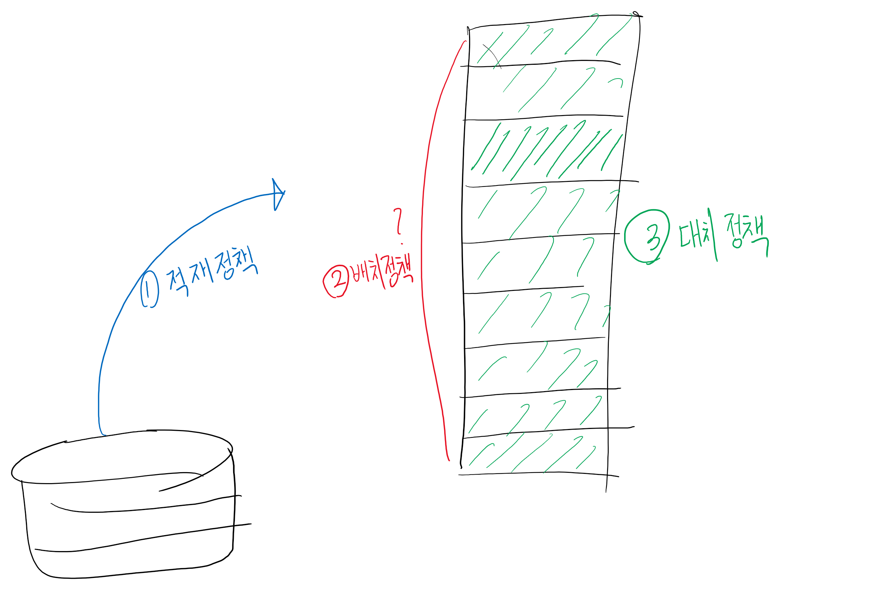

## 다단계 큐 스케줄링(MLQ; Multi-Level Queue)


### 개요

* 각 작업을 서로 다른 묶음으로 분류할 수 있을 때 사용
* 준비 상태 큐를 종류별로 여러 단계로 분할
* 작업을 메모리의 크기나 프로세스의 형태에 따라 특정 큐에 지정
* 각 큐는 자신만의 독자적인 스케줄링을 가짐

### 장점

* 응답이 빠르다

### 단점

* 여러 준비 큐와 스케줄링 알고리즘 때문에 추가적인 오버헤드가 발생한다.
* 우선순위가 낮은 큐의 프로세스는 무한정 대기하는 기아가 발생할 수 있다.

## 다단계 피드백 큐 스케줄링

### 개요

* 작업이 시스템에 들어가면 한큐에서만 고정 실행
* 스케줄링 부담이 적다는 장점이 있으나 융통성이 떨어진다는 단점이 있음
* 작업이 큐 사이 이동 가능(프로세서 버스트의 특성에 따라 분리)

### 구조


### 원리


### 스케줄링 정의 방법

* 큐`queue` 수
* 각 큐에 대한 스케줄링
* 작업을 좀 더 높은 우선순위의 큐로 격상시키는 시기를 결정하는 방법
* 작업을 좀 더 낮은 우선순위의 큐로 격하시키는 시기를 결정하는 방법
* 프로세스들이 어느 큐에 들어갈 것인지 결정하는 방법
* 프로세스가 서비스를 받는 시기를 결정하는 방법

### 장점

* 매우 유연하여 스케줄러를 특정 시스템에 맞게 구성할 수 있다.
* 자동으로 입출력 중심과 프로세서 중심 프로세스로 분류한다.
* 적응성이 좋아 프로세스의 사전 정보가 없어도 최소작업 우선 스케줄링의 효과를 보여 준다.

### 단점

* 설계와 구현이 매우 복잡하다.

## HRN(Highest Response-ratio Next) 스케줄링

### 개요

* 최소작업 우선 스케줄링의 약점인 긴 작업과 짧은 작업 간의 지나친 불평등을 보완
* 비선점 스케줄링이며, 우선순위 스케줄링의 또 다른 예
* 선입선처리 스케줄링과 최소작업 우선 스케줄링의 약점을 해결하기 위해 제안
* 우선순위
  
* 시스템 응답시간
  

## 스레드 스케줄링의 개념

* 스레드를 이용하여 응용 프로그램을 동일한 주소 공간에서 동시에 실행하고 협동하는 스레드들로 구현할 수 있다는 것. 즉, 입출력과 프로세서 처리 중첩 가능
* 스레드 문맥 교환은 프로세스 문맥 교환보다 오버헤드가 적어 응용 프로그램 하나의 여러 스레드를 동시에 다른 프로세서에서 실행한다면 성능 향상 가능. 그러나 스레드 간에 많은 상호작용을 요청하는 응용 프로그램에서는 성능에 큰 영향을 줄 수 있음

## 스케줄링 알고리즘의 평가 기준

* 최대 응답시간이 1초라는 제약 조건에서 프로세서 이용률
* 평균 반환시간이 전체 실행 시간에 선형적으로 비례하는 처리율

## 병행 프로세스 / 병렬 프로세스

* 병행 프로세스: 여러 프로세스가 단일 프로세서에 의해 동시에 처리되는 것
* 병렬 프로세스: 여러 프로세스가 여러 프로세서에 의해 동시에 처리되는 것

## 경쟁 상태

### 개념

여러 프로세스가 동시에 공유 데이터에 접근할 때, 접근 순서에 따라 다른 결과를 발생시킬 수 있는 현상

## 상호배제

### 개념

임계 영역(Critical Section)을 정의하여 여러 프로세스가 동시에 공유 데이터에 접근할 수 없도록 해야 한다.

### 방법

* 소프트웨어적으로 해결: **데커의 알고리즘**, 램포트의 베이커리 알고리즘, 크누스의 알고리즘, 핸슨의 알고리즘, 다익스트라의 알고리즘
* 소프트웨어가 제공(프로그래밍 언어와 운영체제 수준에서 제공): **세마포어**, 모니터
* 하드웨어로 해결(저급 수준의 원자 연산): **TestAndSet**

## 데커의 알고리즘

* P0: P1의 flag(임계영역 진입 의사 있음)가 true이고 P1이 사용할 타이밍이라면 P0은 양보
* P1: P0의 flag(임계영역 진입 의사 있음)가 true이고 P0이 사용할 타이밍이라면 P1은 양보

* 무한 대기 - Busy waiting: while(turn==1) { ... }

## (기말고사) 자원 할당 그래프


* P1, P2, P3, 자원 R1(Instance 2개), R2(Instance 2개) 어떻게 되어 있는지

## 교착상태의 발생 조건

* 상호배제
* 점유와 대기
* 비선점
* 순환(환형) 대기
* 교착 상태의 발생 조건 4가지는 필요 조건이다.
  * 4가지 조건을 모두 만족하더라도 교착 상태가 발생하지 않을 수 있다.
  * 교착 상태가 발생하려면 4가지 조건을 모두 만족 시켜야 한다.

## 교착 상태 해결 방법

### 예방(Prevention)

#### 개요

* 교착 상태의 발생 조건 중 최소한 하나라도 성립하지 않도록 자원 요청을 제한
* 각 프로세스는 필요한 자원을 한 번에 모두 요청해야 하며, 요청한 자원을 모두 제공받기 전까지는 작업을 진행할 수 없다
* 어떤 자원을 점유하고 있는 프로세스의 요청을 더 이상 허용하지 않으면 점유한 자원을 모두 반납하고, 필요할 때 다시 자원을 요청해야 한다.
* 모든 프로세스에 자원을 순서대로 할당해야 한다. 모든 프로세스에 각 자원 유형별로 할당 순서를 부여한 후 순서에 따라 자원을 요청하게 한다.

#### 방법

* 자원의 상호배제 조건 방지
  이론적으로는 가능하나, 실제로는 적용할 수 없다. => 데이터의 소실
* 점유와 대기 조건 방지
* 비선점 조건 방지
  매우 비효율적. 이미 자원을 사용중일 때 이를 선점할 수 있도록 만들면 안되기 때문에 사용X
* 순환(환형) 대기 조건 방지
  주로 사용할 가능성이 높음

### 회피(Avoidance)

#### 개요

* 교착 상태가 발생하는 시점에 다른 자원을 할당 / 자원 할당 거부
* 예방보다는 회피가 병행성을 허용하는 편

#### 방법

* 프로세스의 시작 중단
  프로세스의 요구가 교착 상태를 발생시킬 수 있다면, 프로세스 시작을 중단
* 자원 할당 거부(Banker's Algorithm)
  모니터링을 통해 자원 할당을 거부, 프로세스가 요청한 자원을 할당했을 때 교착 상태가 발생할 수 있다면 요청한 자원을 할당하지 않음

### 탐지(Detection) 및 회복

#### 개요

* 교착이 발생했음을 탐지/감지
* 교착 상태 탐지 알고리즘을 자주 실행하면 성능 하락
* 교착 상태에 빠진 프로세스를 빨리 발견하여 자원의 유휴 상태를 방지 가능. 하지만 자주 실행하지 않으면 반대 상황 발생
* 탐지와 회복 방법은 필요한 정보를 유지하고 탐지 알고리즘을 실행시키는 비용뿐 아니라 교착 상태 회복에 필요한 부담까지 요청

#### 방법

* 프로세스 중단
  * 교착 상태 프로세스 모두 중단 / 한 프로세스씩 중단
  * 프로세스 중단이 쉽지 않을 수 있음
  * 최소 비용으로 프로세스들을 중단하는 우선순위 선정
    * 프로세스가 수행된 시간과 앞으로 종료하는 데 필요한 시간
    * 프로세스가 사용한 자원 형태와 수
    * 프로세스를 종료하는 데 필요한 자원 수
    * 프로세스를 종료하는 데 필요한 프로세스 수
    * 프로세스가 대화식인지, 일괄식인지 여부
      => 일괄식이라면 프로세스를 중단해도 무관할 수 있다.
* 자원 선점
  * 선점 자원 선택
  * 복귀
  * 기아

## 메모리 관리의 개념

* 프로세스들을 위해 메모리 할당, 제거, 보호하는 일련의 활동

## 메모리 관리 정책

```
원시 코드 -> 컴파일(컴파일러) -> 기계코드(*.obj 파일) -> 링킹(링커) -> 실행 파일(바이너리 파일) -> 로더
빌드: Compile + Linking => 컴파일 에러 / 런타임 에러
```



### 적재 정책

* 디스크에서 메모리로, 프로세스 반입 시기를 결정하는 것
* 요구 적재: 운영체제나 시스템 프로그램, 사용자 프로그램 등 참조 요청에 따라 다음에 실행할 프로세스를 메모리에 적재하는 오래된 방법
* 예상 적재: 시스템의 요청을 미리 예측하여 메모리에 적재하는 방법

### 배치 정책

* 디스크에서 반입한 프로세스를 메모리 어느 위치에 저장할 것인지 결정

### 대치 정책

* 메모리가 충분하지 않을 때, 현재 메모리에 적재된 프로세스 중 제거할 프로세스를 결정하는 교체 방법
* swap device / backing store / swapping(swap-out, swap-in)

## 메모리 매핑(사상)

* CPU에서 Memory로 접근할 때, MMU(Memory Management Unit)을 거친다.
* MMU는 R(Relocator) Register가 존재하여, CPU 입장의 논리 주소를 메모리의 물리 주소로 Mapping 해준다.
  => PCB의 Base Register, Limit Register 활용
* MMU: 고정 분할, 동적 분할, 페이징, 시그먼테이션, 페이지화된 세그먼테이션

### 동적 할당과 동적 적재

* 컴파일 시기에 바인딩하는 것이 아닌, 런타임 시기에 바인딩하는 방법(정적 타이밍이 아닌 동적 타이밍)
* 모든 루틴을 메모리에 적재하지 않고 교체 가능한 형태로 디스크에 저장
* 메인 프로그램만 먼저 메모리에 적재하여 수행
* 사용하지 않을 루틴을 메모리에 적재하지 않으므로 메모리를 효율적으로 사용
* 오류가 발생하기도 하지만 프로그램 전체 양이 많을 때 더 유용
* 단, 정적 할당에 비해 런타임 시기에 속도가 지연(딜레이 )될 수 있다.

### DLL: Dynamic Link Loader

* 공통적으로 사용되는 내용을 별도 메모리에 할당하여 관리하는 기법

## 바인딩

### 정적 바인딩

* 컴파일 타임에 바인딩
* 단일 프로그래밍 시스템에서만 적용 가능

### 동적 바인딩

* loader가 loading을 할 때 바인딩하는 것

### 런타임 바인딩

* 실행 단계(실행 중에)에서 바인딩하는 것

## 메모리 측면의 메모리 관리

* 메모리에 존재하는 빈 공간을 `Hole` 이라 부른다.
* Process는 메모리에 연속적으로 할당되어야 한다.
* 메모리 전체적으로 봤을 때, 용량이 있지만 `Hole`로 인해 Process 할당 불가능
  => `외부 단편화` 발생

## 효율적인 메모리

* 속도가 빨라야 한다
* 낭비가 최소화 되어야 한다

## 메모리 할당 기법

* 외부 단편화를 줄이기 위한 Fit, 효과가 크지는 않음
* 종류
  * First Fit(최초 적합): 가장 최초로 접하는 영역에 할당
  * Best Fit(최적 적합): 전체 스캔 후 Fragment가 가장 작게 남는 영역에 할당
  * Worst Fit(최악 적합): 전체 스캔 후 Fragment가 가장 크게 남는 영역에 할당

## Hole 최소화 기법

* 통합: 연속된 Hole을 합치는 행위
* 압축: 떨어진 Hole을 합치는 행위

## 페이징

* 메모리에 연속적으로 할당된 것처럼 CPU를 속이는 행위
* 프로세스를 동일한 크기로 분할(`page`)하고, 분할된 메모리(`frame`)에 나누어 저장

### 매핑

* MMU에서 Page table(Page Index - Frame Index 매핑) 이용, 매핑
  * 독립적인 Chip(H/W) / 직접 매핑
  * Cache로 구현: Hit-Rate(적중률)이 중요, 관건 / 연관 매핑
  * 운영체제 내부에서 S/W로 구현 / 연관 + 직접 매핑

### 페이지 요청

```
* CPU  => [P|d] = > 메모리
* 페이지 크기가 16바이트라면, d에 4비트 필요
```

* \[3|2] => \[1|2] / \[p|d] / d는 해당 frame 영역에서 몇 바이트 떨어져 있는지 표현
  * d는 변하지 않음. p에서 f로 변함

### 내부 단편화

* 페이징 과정에서 메모리를 완벽히 사용하지 못하고, 공간이 남는 현상
* 메모리의 크기가 Frame/Page 크기의 배수가 아닐 때 발생

### 공유 페이지

* 페이징 시스템의 장점인 시분할 환경에서 중요한 공통 코드 공유
* 페이징 시스템에서는 프로세스를 메모리에 연속적으로 할당할 필요가 없기 때문에 여러 프로세스가 메모리 공유 가능
* 다른 프로세스는 메모리의 같은 페이지(지역)을 단순히 가리키도록 해야 하며, 공유 라이브러리 코드에도 사용 가능

### 페이지 보호

* VRWE 보호용 비트를 이용해 권한 관리
  * V: 타당/비타당 => 메인 메모리의 적재 여부
  * R: 읽기 여부
  * W: 수정(쓰기) 여부
  * E: 실행 여부

## 세그먼테이션(Segmantation)

* 페이징을 통해 영역을 나누는 경우, 같은 프레임에 Code, Data, Stack이 겹칠 수 있다.
* 하나의 프로세스가 가지는 영역(Code, Data, Stack)을 의미있는 영역으로 가변 분할
* 크기가 고정적이지 않아 외부 단편화가 발생할 수 있다.

## 페이지화된 세그먼트(Paged segment)

* 세그먼트를 페이지화
* Code, Data, Stack 영역을 분할하여 페이징 개념으로 관리
* 페이징과 세그먼테이션의 장단점 취합
  * 페이징은 내부 단편화가 발생할 수 있으나 메모리 효율적 사용, 작업 크기가 동일하여 다양한 알고리즘을 개발
  * 세그먼테이션은 외부 단편화가 발생할 수 있으나 가변적인 데이터 구조와 모듈 처리, 공유와 보호의 지원 편리
* 외부 단편화 문제를 제거하면서 할당 과정을 쉽게 해결
* 메모리를 세그먼트로 나누고, 해당 세그먼트를 페이지로 분할
* 외부단편화 해결, 내부단편화 최소화
* 2중 매핑 필요
  * MMU는 Segment Table에서 각 Segment에 대한 Page 구분
  * 그 후, Page Table을 이용하여 Page-Frame 매핑

