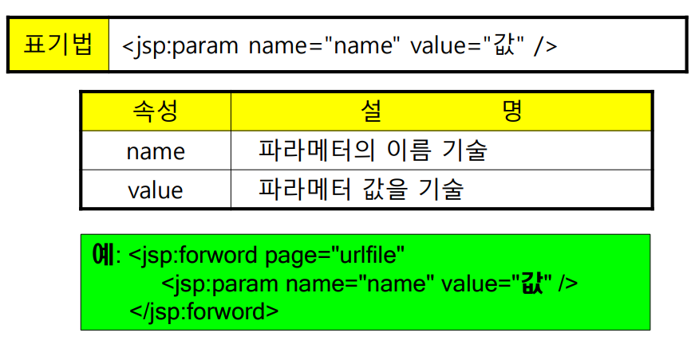
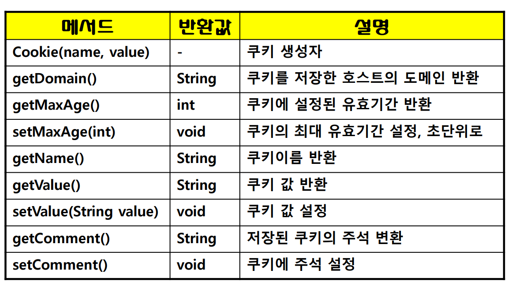
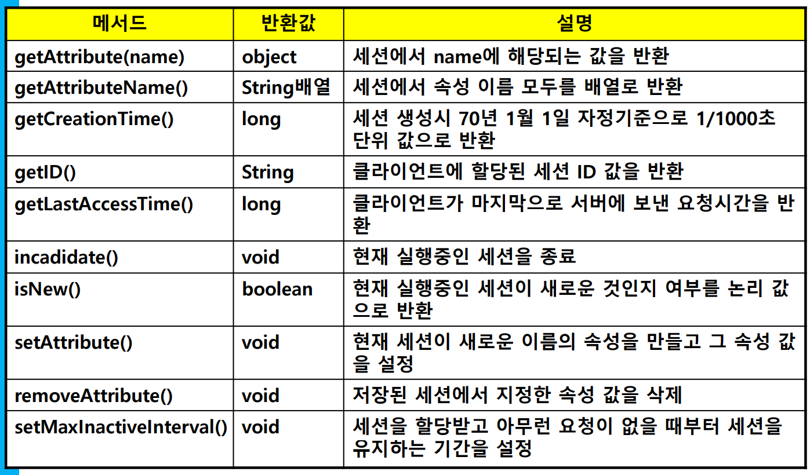
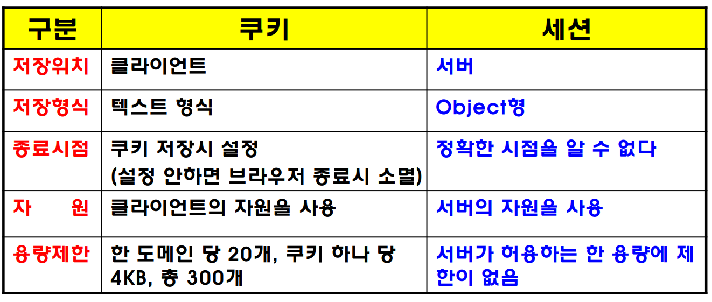

## SELECT 예제

```java
<%@ page contentType="text/html; charset=UTF-8" pageEncoding="UTF-8" language="java"
         import="java.sql.*" %>
<%
    int i = 0;

    String sql = "SELECT * FROM Department";
    String url = "jdbc:oracle:thin:@domain.com:port:SID";
    try {
        Class.forName("oracle.jdbc.driver.OracleDriver");
        Connection connection = DriverManager.getConnection(url, "user_id", "user_pw");
        Statement statement = connection.createStatement();

        ResultSet resultSet = statement.executeQuery(sql);
        while (resultSet.next()) {
            <%=resultSet.getString(1)%>
            <%=resultSet.getString(2)%>
        }
		resultSet.close();
		statement.close();
		connection.close();
	} catch (SQLException e) {
		e.printStackTrace();
	}
%>
```

## UPDATE 예제

```java
<%@ page contentType="text/html; charset=UTF-8" pageEncoding="UTF-8" language="java" import="java.sql.*" %>
<% request.setCharacterEncoding("UTF-8");%>
<%
    String Dept_ID = request.getParameter("dept_id");
    String Dept_Name = request.getParameter("dept_name");
    String Dept_Tel = request.getParameter("dept_tel");

    String url = "jdbc:oracle:thin:@domain.com:port:SID";
    String sql = "UPDATE Department ";
    sql += "SET Dept_Name = ?, Dept_Tel = ? ";
    sql += "WHERE Dept_ID = ?";
    try {
        Class.forName("oracle.jdbc.driver.OracleDriver");
        Connection con = DriverManager.getConnection(url, "user_id", "user_pw");
        PreparedStatement pstmt = con.prepareStatement(sql);

        pstmt.setString(1, Dept_Name);
        pstmt.setString(2, Dept_Tel);
        pstmt.setString(3, Dept_ID);
        pstmt.executeUpdate();

        pstmt.close();
        con.close();
        out.println(Dept_Name + ", " + Dept_Tel + " 로 수정되었습니다.");
    } catch (Exception e) {
        out.println(Dept_ID + "의 학과코드 수정이 실패했습니다");
    }
%>
```

## DELETE 예제

```java
<%@ page contentType="text/html; charset=UTF-8" pageEncoding="UTF-8" language="java" import="java.sql.*" %>
<% request.setCharacterEncoding("UTF-8");%>
<%
    String dept_id = request.getParameter("dept_id");
    String url = "jdbc:oracle:thin:@domain.com:port:SID";

    String sql = "DELETE FROM Department WHERE Dept_ID = ?";

    try {
        Class.forName("oracle.jdbc.driver.OracleDriver");
        Connection con = DriverManager.getConnection(url, "user_id", "user_pw");
        PreparedStatement pstmt = con.prepareStatement(sql);
        pstmt.setString(1, dept_id);
        pstmt.executeUpdate();

        pstmt.close();
        con.close();
        out.println(dept_id + "의 학과코드가 삭제되었습니다.");
    } catch (Exception e) {
        out.println(dept_id + "의 학과코드는 삭제되지 않았습니다.");
    }
%>
```

## JSP 표준액션 태그

* 클라이언트 또는 웹서버에게 어떠한 동작을 지시하는 태그
* 자바빈즈 지원 태그: 3종류
* 부가적인 기능 지원 태그: 4종류
  

## 자바빈

### 개념

* 재사용이 가능한 객체지향 프로그래밍 인터페이스
* 데이터를 다루기 위해서 자바로 작성되는 소프트웨어 컴포넌트
* JSP에서 사용하는 자바빈의 컴포넌트 클래스
* 구조 단순, 작성 용이

### JSP 페이지에서 자바빈

* 입력 폼의 데이터와 데이터베이스의 데이터 처리 부분에 활용
* 재사용이 가능한 객체
* MVC 설계 패턴에서 모델로 사용

### 자바빈의 규약

* 클래스는 반드시 파라미터가 없는 기본 생성자를 가진다.
* 클래스는 직렬화되어야 한다.
* 프로퍼티는 get, set 메소드를 통해 읽고 저장할 수 있어야 한다.
* 프로퍼티마다 getter, setter가 있어야 한다.
* getter는 파라미터가 없어야 한다.
* setter는 하나 이상의 파라미터를 가진다.
* 프로퍼티 접근제어자는 private
* getter/setter와 클래스는 public으로 선언해야 한다.

### 프로퍼티

* 클래스의 상태를 유지하고, 동작을 지정하는 속성
* 변수형태
* 예: 입력폼의 필드명, 테이블의 칼럼명 등

### 메서드

* 프로퍼티를 외부에 사용하기 위한 통로 역할
* 컴포넌트를 조작할 수 있도록 하는 방식을 제공
* 함수 형태

### LoginBean 예제

```java
package ch08;

public class LoginBean {
    private String id = "";
    private String pw = "";

    public String getId() {
        return id;
    }

    public void setId(String id) {
        this.id = id;
    }

    public String getPw() {
        return pw;
    }

    public void setPw(String pw) {
        this.pw = pw;
    }
}
```

### 웹프로젝트 개발의 자바빈 활용


### 자바빈의 스코프(scope) 속성


| 영역        | 설명                                                   |
| ----------- | ------------------------------------------------------ |
| page        | 요청에 의해 생성된 페이지에서만 객체가 사용            |
| request     | 클라이언트의 요청이 수행하는 페이지에서 객체가 사용    |
| session     | 객체가 생성된 세션에서 요청을 처리하는 페이지에서 사용 |
| application | 객체가 생성된 응용 프로그램에 포함된 페이지에서 사용   |

### 자바빈 표준 액션 태그

* `<jsp:useBean>` 태그
  
  * JSP 페이지에서 주어진 영역에 특정 자바빈을 사용하기 위해 컨테이너에게 알려주는 태그
  * 자바빈 이름 지정
* `<jsp:setProperty>` 태그
  
  * JSP 페이지에서 `<jsp:useBean>` 태그로 지정한 자바빈에 주어진 영역에서 자바빈의 프로퍼티 값 설정
* `<jsp:getProperty>` 태그
  
  * JSP 페이지에서 `<jsp:useBean>` 태그로 지정한 자바빈으로부터 주어진 영역에서 자바빈의 프로퍼티 값을 반환

### 부가적인 액션 태그

* `<jsp:include>` 태그
  
  * JSP 페이지에서 다른 JSP 페이지나 HTML 페이지를 포함하는 태그
  * 주로 동적인 웹 페이지를 포함
  * 정적인 웹페이지 문서도 가능
  * 헤더 정보나 쿠키 값 설정이 불가능하고, 페이지 변경이 발생될 때마다 컴파일하기 때문에 성능을 저하시키는 요인
* `<jsp:forward>` 태그
  
  * 현재 실행중인 JSP 페이지에서 url로 지정한 특정 JSP 펭지로 이동하는 액션 태그
* `<jsp:param>` 태그
  * 요청한 페이지로 정보를 전달할 때 사용하는 액션 태그
  * 단독 사용 불가
  * `<jsp:include>`, `<jsp:forward>`, `<jsp:plugin>` 서브원소로 사용
  * 현재 페이지에서 요청한 페이지로 파라미터 값을 전달
    

## HTTP

### 특성

* 사용자가 클라이언트에서 어떤 정보를 요청할 때 접속되고 요청한 정보의 응답이 끝나면 접속이 해제되는 프로토콜
* 장점: 서버 부하나, 네트워크의 부하에 효율적
* 단점: 서버에서 사용자가 이전 페이지에 어떠한 일을 했는지 사용자에 대한 정보를 유지할 수 없음
  * HTTP는 한 번의 접속으로 필요한 처리를 하고 바로 접속 해제

### HTTP의 이러한 단점 극복을 위한 상태유지 방법

* 쿠키(cookie)와 세션(session)

## 쿠키(cookies)

### 개요

* 서버측에서 클라이언트측에 상태 정보를 저장하고 추출할 수 있는 매커니즘
* 클라이언트의 매 요청마다 웹 브라우저로부터 서버에게 전송되는 정보 패킷의 일종
* 서버가 클라이언트에 전송하여 저장하는 텍스트 조각
* HTTP에서 클라이언트의 상태 정보를 클라이언트의 하드 디스크에 저장하였다가 필요시 정보를 참조하거나 재사용

### 쿠키 설정

* 1단계: Cookie 생성자로 쿠키 객체를 생성

  ```java
  Cookie 객체명 = new Cookie(이름, 값);
  ```

* 2단계: `setMaxAge()` 메서드로 쿠키 객체의 유효기간 설정(초 단위)

  ```java
  객체명.setMaxAge(유효기간);
  ```

* 3단계: response 내장객체의 `addCookie()` 메서드로 클라이언트에 전송(하드디스크 전송)

  ```java
  response.addCookie(객체명);
  ```

### 주요 메소드



### 쿠키의 제약조건

* 클라이언트에 총 300개까지 쿠키 저장 가능
* 하나의 도메인 당 20개
* 하나의 쿠키 값은 4096 Byte까지

### 예제

```java
<%@ page contentType="text/html;charset=UTF-8" language="java" pageEncoding="UTF-8" %>
<%
    String id = request.getParameter("id");
    String passwd = request.getParameter("pw");
    boolean found = false;
    Cookie[] cookies = request.getCookies();

    for (int i = 0; i < cookies.length; i++) {
        if (cookies[i].getName().equals("MyCookie")) {
            found = true;
            break;
        }
    }

    if (!found) {
        Cookie cookie = new Cookie("MyCookie", id);
        cookie.setMaxAge(60 * 60);
        response.addCookie(cookie);
        out.println("쿠키를 최초로 설정합니다.<br>");
    } else {
        out.println("쿠키가 설정되어 있습니다.");
    }
%>
```

## 세션(session)

### 개요

* 클라이언트와 웹서버간에 네트워크 연결이 지속적으로 유지되고 있는 상태
* 클라이언트가 웹서버에 요청하여 접속하면 JSP 엔진은 요청한 클라이언트에 유일한 ID를 부여 => `session ID`
* `session ID` 이용 방법
  * 각 클라이언트에 유일한 세션 ID를 부여하여 서로 다른 서버의 접근 권한 부여
  * 세션 객체마다 저장해 둔 데이터를 이용하여 서로 다른 클라이언트의 요구에 맞는 서비스 제공
  * 클라이언트 자신만의 고유한 페이지를 열어 놓아서 생길 수 있는 보안상의 문제 해결

### 활용

* 쇼핑몰의 장바구니 관리, 회원(로그인) 인증 등

### 세션 설정

* 표기: `session.setAttribute(name, value);`

* 세션을 설정할 때, 문자형의 경우

  ```java
  String id = request.getParameter("id");
  session.setAttribute("id", id);
  ```

* 정수형일 경우

  ```java
  Integer num = new Integer(100);
  session.setAttribute("num", num);
  ```

### session 내장객체의 주요 메서드



### 세션 값 얻어내기

* 일반 형식

  ```java
  Object 변수명 = session.getAttribute(name);
  ```

* 문자형으로 변환하는 경우

  ```java
  Object id_getdata = session.getAttribute("id");
  String session_id = (String)id_getdata;
  // OR
  String session_id = session.getAttribute("id").toString();
  ```

* 숫자형으로 변환하는 경우

  ```java
  Integer num_getdata = (Integer)session.getAttribute("num");
  int session_num = num_getdata.intValue();
  ```

### 예제

```java
<%
    String session_id = session.getAttribute("id").toString();
    String session_pw = session.getAttribute("pw").toString();

    out.println("<h4> 세션 값을 얻어오는 예제 </h4>");
    out.println("<hr>");
    out.println("얻어온 세션 값은 다음과 같습니다.");
    out.println("<hr>");

    out.println("설정된 세션 값 [1] =>" +session_id + "<br><br>");
    out.println("설정된 세션 값 [2] =>" +session_pw + "<hr>");
%>
```

### 세션 종료와 제거

#### 자동 종료

* 웹브라우저 종료
* 지정한 시간 경과

#### 강제 종료

* `session.invalidate();` 메서드 호출

#### 완전 제거

* `session.removeAttribute(name);`

## 쿠키와 세션 비교



## 서블릿(Servlet)

### 개요

```java
import java.io.*;
import javax.servlet.*;
import javax.servlet.http.*;
```

### 장점

* 컨텐츠와 비즈니스 로직의 분리 가능
* 컨트롤러와 뷰의 역할 분담으로 웹디자이너와 개발자간의 공동작업 가능
* 유지보수와 기능확장 용이
* 프로그래머가 HTML, JavaScript, StyleSheet 등 모두 숙지할 필요 없음

## EL(Expression Language)

### 주요 기능

* 리터럴 데이터 출력
* 다양한 연산자와 연산결과 출력 지원
* 4개의 scope(`page`, `request`, `session`, `application`) 속성 값 출력
* JSTL 연동

### 장점

* HTML, 스크립트릿, <%=%> 표현의 가독성 향상

## JNDI 등록과 DBCP를 이용한 DB 연동

* `WebContent/META-INF/context.xml` 생성
  type, driverClassName, url, username, userpass
* 1단계: import `javax.sql.*`, `javax.naming.*`
* 2단계: Connection 수립

## EL 내장객체

* Scope: pageScope, requestScope, sessionScope, applicationScope
* 요청 파라미터: param, paramValues
* 헤더 값: header, headerValues
* 쿠키 값: Cookies

## JSTL(JSP Standard Tag Library)

### 개요

* `core`, `format`, `database`, `xml`, `functions` 5개의 라이브러리
* `functions` 는 함수, 4개 라이브러리들은 커스텀 액션 태그