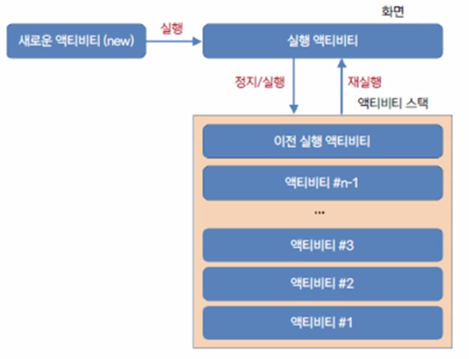
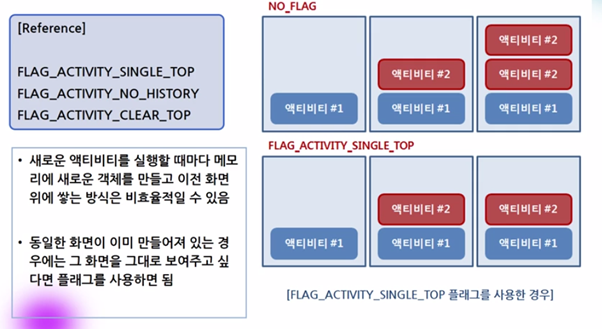
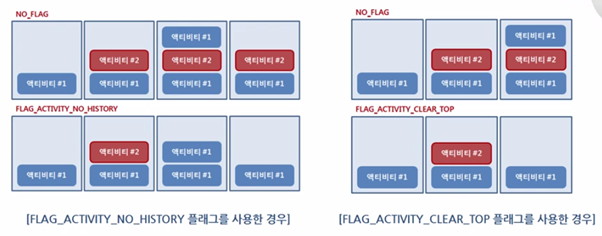
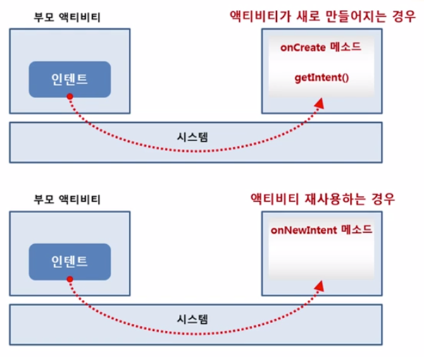
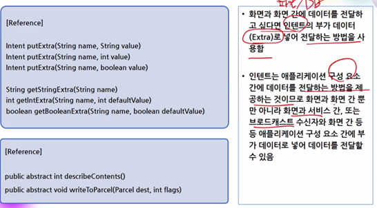
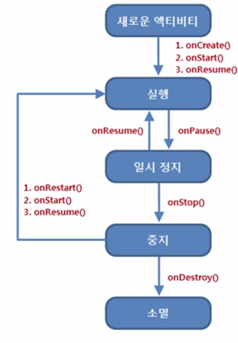
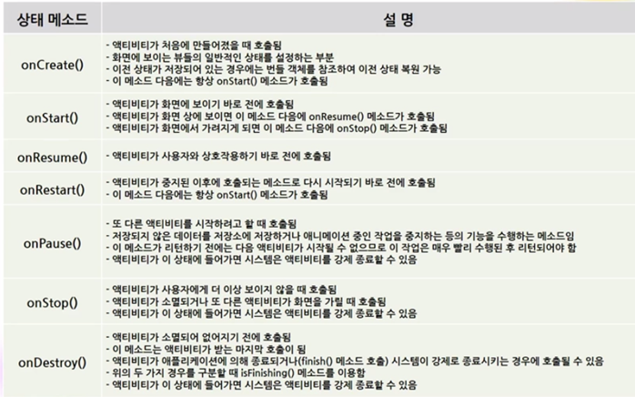

## 레이아웃 인플레이션 메소드

```java
View inflate (int resources, ViewGroup root);
static LayoutInflater LayoutInflater.from (Context context);
static View inflate (Context context, int resources, ViewGroup root);

Intent(String action [,Uri uri]);
Intent(Context packageContext, Class<?> cls);
```

## 인텐트

### 명시적 인텐트(Explicit Intent)

* 인텐트에 클래스 객체나 컴포넌트 이름을 지정하여 호출할 대상을 확실히 알 수 있는 경우
* 같은 프로젝트 내에서 Activity의 이름을 알고 있을 때, 다른 Activity를 호출하는 목적으로 사용

### 암시적 인텐트(Implict Intent)

* 액션과 데이터를 지정하긴 했지만 호출할 대상이 달라질 수 있는 경우 사용
* Activity의 이름은 모르지만 동작은 알고 있을 때, 즉 다른 App 간의 연동 시 사용(Action 정보 부여)
* `manifests`에서 ACTION에 대한 intent filter를 정의해둠
* 범주(category), 타입(type), 컴포넌트(component), 부가 데이터(extras)

### 인텐트의 대표적 속성

* 범주(Category)
  * 액션이 실행되는 데 필요한 추가적인 정보를 제공
* 타입(Type)
  * 인텐트에 들어가는 데이터의 MIME 타입을 명시적으로 지정
* 컴포넌트(Component)
  * 인텐트에 사용될 컴포넌트 클래스 이름을 명시적으로 지정
* 부가 데이터(Extra)
  * 인텐트는 추가적인 정보를 넣을 수 있도록 번들(Bundles) 객체를 담고 있음
  * 이 객체를 통해 인텐트 안에 더 많은 정보를 넣어 다른 애플리케이션 구성요소에 전달할 수 있음

## 플래그와 부가 데이터









## 부가 데이터 전달하기



## android:launchMode

* 플래그와 동일
* singleTop: 액티비티가 하나만 생성
* singleTask: 액티비티 생성 시점에 새로운 태스크 생성, 이전 태스트 공유 X
* singleInstance: 액티비티 생성 시점에 새로운 태스크 생성, 독립적

## 액티비티 생명주기





## startActivityForResult

* 매개변수: Intent Object, Request Code
* 응답: Intent Object, Result Code

## 객체 데이터의 저장과 복구

### 개요

* 객체는 몇 바이트로 이루어져있는지 예측할 수 없다.
* 이에 바이트 단위로 객체 자체를 `Serialize` 해주는 과정이 필요하다.
* 그 후 `Deserialize`하여 복구한다.

### 방법

#### Serializable Interface 구현

* Class 내부에 Serialize 되지 않는 객체가 있다면 Serialize 되지 않음
* 상속만 받으면 되기 때문에 구현이 편리함

#### Paracelable Interface 구현

* 별도의 메소드 오버라이딩이 요구됨
* Serializable Interface에 비해 메모리 관리가 효율적
  ==> Why?
* Creator, writeToParcel, describeContents Method 구현 필요

## LifeCycle

* onResume() 단계에서 복구하는 것이 바람직
* onPause() 단계에서 저장하는 것이 바람직

## sharedPreferences

* 간략한 File 형태로 상태를 저장하기 위해 사용
* `getSharedPreferences("pref", Activity.MODE_PRIVATE);` 메소드 호출 시 해당 프로젝트의 `sharedPreferences` 폴더에 pref라는 이름으로 파일 저장(상태 저장)

## Fragment

### 개요

* 레이아웃 안에 다른 레이아웃을 배치하여 UI를 구성하는 방식
* 전체 Activity를 분할하여 관리/적용 (소규모 Activity라고 볼 수 있음)
* `layout.xml` 파일에서 fragment 태그에서 차지할 영역을 지정할 수 있다.
  * `android:name` 속성으로 어떤 Class(다른 Widget을 상속 받은)를 사용할 것인지 지정
* 화면(layout xml) 재사용 + 기능(java, kotlin class) 재사용
* 실제 사용시에는 독립적으로 사용할 수 없으며, 반드시 Activity에 소속되어 있어야 한다.
* `Inflater`를 통해 Fragment의 ViewGroup을 얻어올 수 있다.

### 주의점

* Fragment는 기능과 화면이 독립적인 것이 가장 이상적이다.
* 그러므로 Fragment에 Attached Activity에 종속적이지 않게끔 설계하는 것이 요구된다.
  => `getActivity()`를 통해 Attached Activity 획득

### LifeCycle - Activity에 Fragment 추가

* onAttach
* onCreate
  Fragment만 생성
* onCraeteView
  Fragment의 View, Widget 생성 / Fragment에 대한 이벤트 처리 가능
* onActivityCreated
  Acitivity의 Create가 완료된 상태 / Activity Level의 Widget에 대한 작업 시 해당 LifeCycle에서 처리 해야 함
* onStart
* onResume

### LifeCycle - Activity에서 Fragment 제거

* onPause
* onStop
* onDestroyView
* onDestory
* onDetach

## 안드로이드의 메뉴

### 옵션 메뉴

* 하드웨어 [메뉴] 버튼을 눌렀을 때 나타나는 메뉴, 각 화면마다 설정된 주요 메뉴
* 옵션 메뉴는 최대 6개까지의 메뉴 아이템을 포함할 수 있음
* 그 이상의 메뉴 아이템을 추가하면 "More"라는 메뉴 아이템으로 표시됨
* 액션바(햄버거 메뉴)와 연동 가능

### 컨텍스트 메뉴

* 화면을 길게 누르면 나타나는 메뉴로 텍스트뷰의 편집 상태를 바꾸거나 할 때 사용
* 뷰에 설정하여 나타나게 할 수 있음

## ViewPager

* 손가락으로 좌우 스크롤하여 프래그먼트 화면을 전환하는 것
* 어댑터(Adapter) - `Adapter View` `Adapter Item`을 통해 구현 가능

## 어댑터

* `ViewPager`을 구현할 때 `FragmentStatePagerAdapter`를 활용
* `FragmentStatePagerAdapter` 를 상속하고, `getItem`, `getCount` 메소드를 오버라이딩하면 된다.

## 바로가기 메뉴

* 좌측 상단 햄버거 모양 아이콘을 눌렀을 때 나타나는 화면으로 기본화면 유형(`Navigation Drawer Activity`)에 있음

## 서비스

* 서비스는 화면이 없는 상태에서 백그라운드로 실행됨
* 서비스는 프로세스가 종료되어도 시스템에서 자동으로 재시직함
* 여러 액티비티에서 공통적으로 사용하려는 기능을 사전 정의하고 호출할 수 있도록 지원 - `Service` 객체 
* 프로세스
  1. 시작 시키기 `startService()`
  2. (서비스) `onCreate` / `onBind` 호출
  3. (서비스) `onDestory()` 호출
  4. (시스템) 자동 재시작 => 2번으로 이동

## Broadcast Receiver

* 브로드캐스트 수신자는 인텐트 필터를 포함
* 매니페스트 파일에 등록함으로써 인텐트를 받을 준비를 함

## Content Provider

* ,
* ,

## 